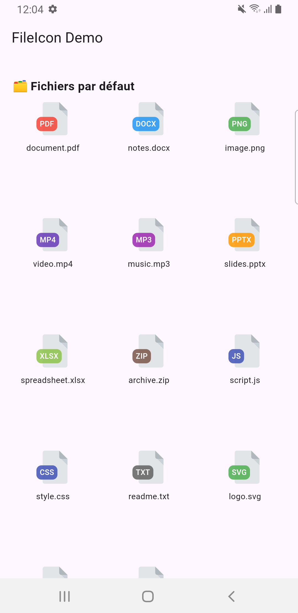
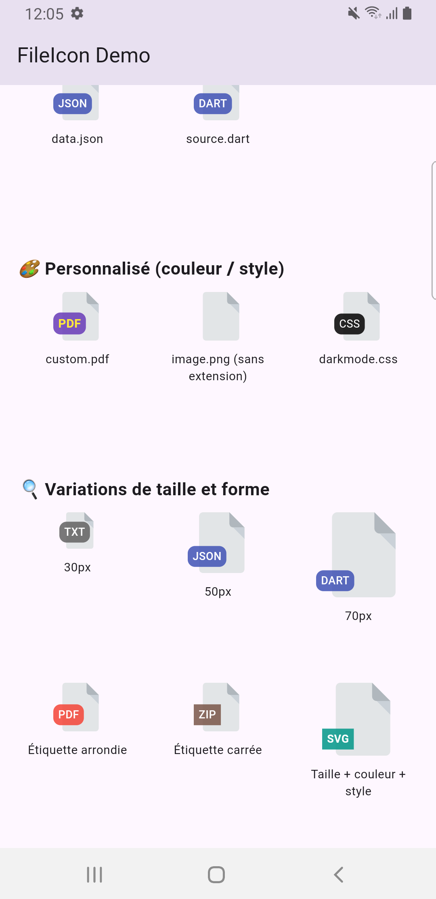

# 📂 icon_file

A Flutter package to automatically display a file icon (SVG) with a dynamic badge based on the file extension (`.pdf`, `.jpg`, `.zip`, etc.).  
Perfect for file explorers, downloads, or file previews in apps.

## 🧩 Features

- Automatic detection of the file extension
- Dynamic colored badge based on file type
- Customizable style (color, text, etc.)
- Supports over **30 common extensions**
- Ready for responsive layouts (ScreenUtil)
- Dark mode friendly

---

## 📸 Preview

| Default Icons                                    | Customized Icons                                 |
|--------------------------------------------------|--------------------------------------------------|
|  |  |

---

## 🚀 Installation

Add this to your `pubspec.yaml`:

```yaml
dependencies:
  icon_file: ^1.0.X
```

Then run:

```bash
flutter pub get
```

---

## 🛠️ Basic Usage

```dart
import "package:icon_file/icon_file.dart";
FileIcon("document.pdf");
```

---

## 🎨 Example with Custom Styles

```dart
FileIcon(
  "custom.pdf",
  color: Colors.deepPurple,
  extensionStyle: TextStyle(
    fontSize: 12,
    fontWeight: FontWeight.bold,
    color: Colors.yellow,
  ),
)
```

---

## 💡 Available Parameters

| Parameter         | Description                                                                 |
|-------------------|-----------------------------------------------------------------------------|
| `fileName`        | (required) File name with extension (`document.pdf`)                        |
| `color`           | Custom background color for the badge (optional)                           |
| `showExtension`   | Whether to show the badge with the extension (default: `true`)             |
| `extensionStyle`  | Text style for the extension badge                                          |
| `assetIcon`       | Custom path to SVG icon (default: `assets/file.svg`)                        |
| `size`            | Size of the icon (default: `80`)                                            |
| `roundedLabel`    | Whether the badge has rounded corners (default: `true`)                     |

---

## 🔍 Supported Extensions

This package automatically supports the following file types (and can be extended):

`pdf`, `doc`, `docx`, `ppt`, `pptx`, `xls`, `xlsx`, `csv`, `txt`, `png`, `jpg`, `jpeg`, `svg`, `mp3`, `wav`, `aac`, `mp4`, `avi`, `mov`, `js`, `css`, `html`, `json`, `xml`, `zip`, `rar`, `7z`, `tar`, `gz`, `dart`

---

## 🧪 Full Example (UI)

```dart
List<String> files = [
  'document.pdf',
  'notes.docx',
  'image.png',
  'video.mp4',
  'music.mp3',
  'slides.pptx',
  'spreadsheet.xlsx',
  'archive.zip',
  'script.js',
  'style.css',
  'readme.txt',
  'logo.svg',
  'data.json',
  'source.dart',
];

List<Widget> icons = files.map((file) => FileIcon(file)).toList();
```

---

## 👥 Contributing

Contributions are welcome!  
Feel free to open an **issue**, submit a **pull request**, or simply **report a bug**.

---

## 📄 License

This project is licensed under the [MIT License](LICENSE).
